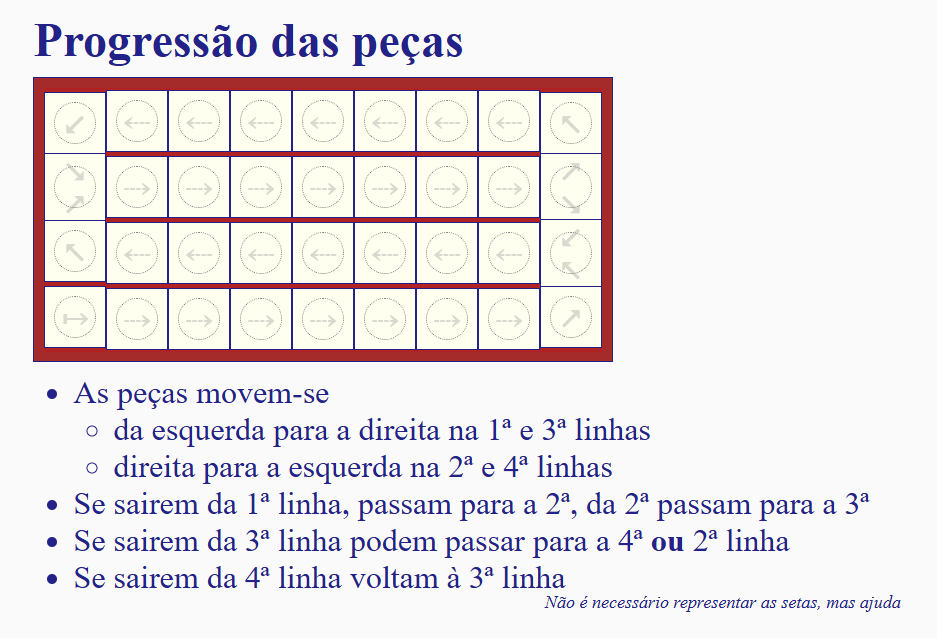

# To Do List

## Part 1
- ~~When we select a piece and then another piece, the highlight does not disappear, being the two pieces highlighted.~~
- ~~AI model, at least a random version (URGENT)~~
- ~~When starting a new game, the message that was showed last, does not disappear~~
- ~~When starting a new game, the last dice number, does not disappear~~
- ~~If we only can make one move, but we selected other piece that cannot move due to the fact that the possible move (which, in fact, is not possible) is to the cell where the piece we can move is at, we get stuck, unnable to move.~~
- ~~Simple but working Scoreboard~~
- Scoring function to improve scoreboard
- ~~CheckWin() function~~ 
- ~~CheckWin calls the saveScoreboard function.~~
- ~~Game buttons should only work when game has started~~
- ~~Logic issue found, the second dice should be granted even if we cannot move. (RN if we didn't move any piece yet and we get 4/6 on the dice roll, we cannot move nor re-roll, which is not what is intended).~~
- On the select "firstPlayer", the options should be jogador1/jogador2/ai, instead of human/ai, in order to implement, in the future, the PvP option. Didn't change this already because it is hardcoded in a lot of instances.
- Refine the movement logic, as we are not following the correct behavior. Apparently we should be able to go back.

- No one can move to the 4th line, blue cannot return there and red cannot reach it.
- better user experience, buttons location more logging

--- 

## Part 2 and 3
- Implement the requests
    - register(nick, password) - register a user associated to a password
    - join(group, nick, password, size) - join players to start the game
    - leave(nick, password, game) - leave the game
    - roll(nick, password, game, cell) - roll the dice
    - pass(nick, password, game, cell) - pass the turn
    - notify(nick, password, game, cell) - notify the server of a move
    - update(nick, game) - update the game state
    - ranking(group, size) - return the scoreboard
- Implement the responses
    - register (error)
    - join (error, game)
    - leave (error)
    - notify (error)
    - update (cell, dice, error, initial, mustPass, pieces, players, selected, step, turn, winner)
    - ranking (error, ranking)

- O servidor deverá estar estruturado em módulos. O ficheiro principal, que carrega os restantes módulos, define a função de processamento de pedido e inicia a sua escuta, deve chamar-se: index.js